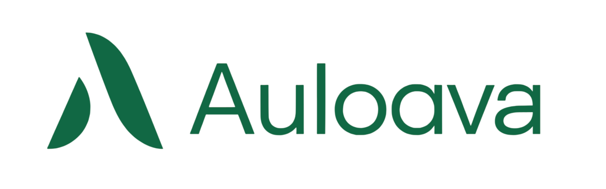

# Auloava

<p align="center">
  
  
  
  
  
  
  
  
</p>

Auloava is an affiliate product catalog that compares deals from the three largest ecommerce marketplaces — AliExpress, Amazon and Alibaba — in a single place. The experience is built around a Pinterest-style masonry feed where shoppers can browse curated products, compare prices, ratings and commissions, and reach the best offer through verified affiliate links.

## Overview

Auloava is designed for shoppers, not store owners. Visitors land on a public marketing site, explore a visual catalog of hand-picked offers, and are guided to the most convenient marketplace to complete their purchase. An administrative area is available for managing the product inventory behind the scenes.

## Features

- **Pinterest-style catalog** — a responsive masonry grid of product pins with variable heights and hover actions.
- **Marketplace comparison** — products from AliExpress, Amazon and Alibaba shown side by side with price, rating and commission.
- **Public landing page** — hero mosaic, featured offers, value propositions, how-it-works timeline and social proof.
- **Public catalog** (`/catalog`) — a dedicated browsing page with live search, separated from the admin dashboard.
- **Admin dashboard** (`/app`) — manage products, create and edit affiliate listings.
- **Fully responsive** — layouts adapt from desktop down to mobile without horizontal overflow.

## Tech Stack

- **Vue 3** (Composition API, `<script setup>`)
- **Vite 5** as the build tool and dev server
- **Pinia** for state management
- **Vue Router 4** for routing
- **Axios** for API communication
- **Firebase** (Realtime Database + Analytics) as the backend for the product catalog

## Getting Started

### Prerequisites

- Node.js 18 or higher
- A package manager (npm, pnpm or yarn)

### Installation

```bash
npm install
```

### Development

```bash
npm run dev
```

The application will be available at the local dev server URL printed in the terminal (default `http://localhost:5173`).

### Build

```bash
npm run build
```

### Preview production build

```bash
npm run preview
```

## Project Structure

```
src/
  components/
    layout/        # Header, footer and shared layout pieces
    product/       # ProductCard (pin) and related components
    ui/            # Reusable UI primitives
  constants/       # Static configuration (platforms, categories)
  router/          # Route definitions
  services/        # API layer and mock data
  store/           # Pinia stores (products)
  utils/           # Formatters and directives
  views/
    public/        # LandingView, CatalogView, NotFoundView
    private/       # DashboardView, ProductsView, ProductFormView
  assets/styles/   # Global base styles and design tokens
```

## Scripts

| Script            | Description                          |
| ----------------- | ------------------------------------ |
| `npm run dev`     | Start the Vite development server    |
| `npm run build`   | Build the project for production     |
| `npm run preview` | Preview the production build locally |

## License

Released under the MIT License.
